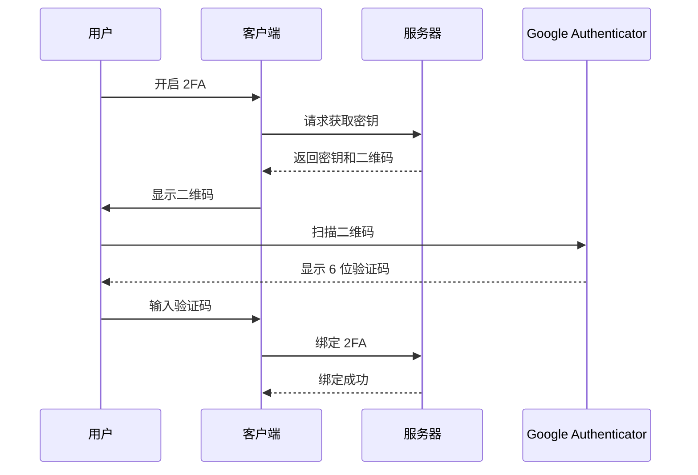

# 2FA 认证 API

提供双因素认证功能的 API 接口。

## 支持的认证方式

- **Google Authenticator** (TOTP - Time-based One-Time Password)

## 接口列表

| 接口 | Method | Path | 说明 |
|------|--------|------|------|
| 获取 2FA 密钥 | GET | `/api/v1/client/2fa/secret` | 获取 TOTP 密钥和二维码 |
| 绑定 2FA | POST | `/api/v1/client/2fa/bind` | 验证并绑定 2FA |
| 验证 2FA | POST | `/api/v1/client/2fa/verify` | 验证 2FA 验证码 |
| 解绑 2FA | POST | `/api/v1/client/2fa/unbind` | 解除 2FA 绑定 |

## 使用流程



## 请求示例

### 获取 2FA 密钥

```bash
curl -X GET "https://dev-client.beauty-666.com/api/v1/client/2fa/secret" \
  -H "Authorization: Bearer YOUR_ACCESS_TOKEN"
```

### 响应示例

```json
{
  "code": 0,
  "msg": "success",
  "data": {
    "secret": "JBSWY3DPEHPK3PXP",
    "qr_code": "data:image/png;base64,..."
  }
}
```

### 绑定 2FA

```bash
curl -X POST "https://dev-client.beauty-666.com/api/v1/client/2fa/bind" \
  -H "Authorization: Bearer YOUR_ACCESS_TOKEN" \
  -H "Content-Type: application/json" \
  -d '{"code": "123456"}'
```

## 参数说明

### 绑定/验证请求参数

| 参数 | 类型 | 必填 | 说明 |
|------|------|------|------|
| code | string | 是 | 6 位数字验证码 |

## 错误码

| 错误码 | 说明 |
|--------|------|
| INVALID_CODE | 验证码无效 |
| CODE_EXPIRED | 验证码已过期 |
| 2FA_NOT_ENABLED | 2FA 未启用 |
| 2FA_ALREADY_ENABLED | 2FA 已启用 |

<Warning>
2FA 密钥仅在首次获取时显示，请提醒用户妥善保管。如果丢失，需要通过客服重置。
</Warning>
