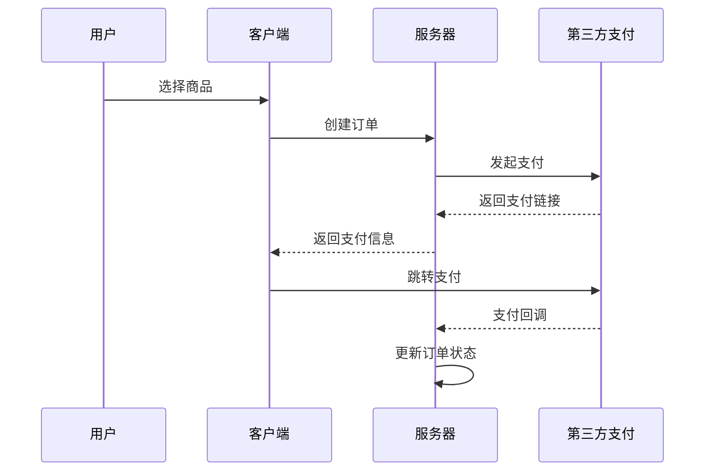

# 支付服务 API

提供第三方支付功能的 API 接口。

## 接口列表

| 接口 | Method | Path | 说明 |
|------|--------|------|------|
| 申请充值 | POST | `/api/v1/purchase/deposit` | 创建充值/购买订单 |
| 查询订单 | GET | `/api/v1/purchase/deposit/query` | 查询订单状态 |

## 支付流程



## 申请充值

### 请求示例

```bash
curl -X POST "https://dev-client.beauty-666.com/api/v1/purchase/deposit" \
  -H "Authorization: Bearer YOUR_ACCESS_TOKEN" \
  -H "Content-Type: application/json" \
  -d '{
    "payment_provider": "fgpay",
    "channel_code": "alipay",
    "payer_name": "测试用户",
    "return_url": "https://example.com/return",
    "product_type": "diamond",
    "product_id": 1
  }'
```

### 请求参数

| 参数 | 类型 | 必填 | 说明 |
|------|------|------|------|
| payment_provider | string | 是 | 支付提供商，固定值 `fgpay` |
| channel_code | string | 是 | 支付渠道代码 |
| payer_name | string | 是 | 付款人姓名 |
| return_url | string | 否 | 支付完成返回地址 |
| product_type | string | 是 | 产品类型：`diamond` 或 `membership` |
| product_id | integer | 是 | 产品 ID |

### 产品类型说明

| product_type | product_id | 说明 |
|--------------|------------|------|
| diamond | 1-N | 钻石方案 ID |
| membership | 1 | 月度会员 |
| membership | 2 | 季度会员 |
| membership | 3 | 半年会员 |
| membership | 4 | 年度会员 |

### 响应示例

```json
{
  "code": 0,
  "msg": "success",
  "data": {
    "out_order_no": "D20251229120000abc12345",
    "pay_url": "https://pay.example.com/pay?order=xxx",
    "amount": "100"
  }
}
```

### 响应参数说明

| 参数 | 类型 | 说明 |
|------|------|------|
| out_order_no | string | 系统订单号 |
| pay_url | string | 第三方支付链接 |
| amount | string | 订单金额 |

## 查询订单

### 请求示例

```bash
curl -X GET "https://dev-client.beauty-666.com/api/v1/purchase/deposit/query?out_order_no=D20251229120000abc12345" \
  -H "Authorization: Bearer YOUR_ACCESS_TOKEN"
```

### 请求参数

| 参数 | 类型 | 必填 | 说明 |
|------|------|------|------|
| out_order_no | string | 是 | 系统订单号 |

### 响应示例

```json
{
  "code": 0,
  "msg": "success",
  "data": {
    "out_order_no": "D20251229120000abc12345",
    "thirdparty_order_no": "TP20251229000001",
    "status": "pending",
    "order_type": "diamond",
    "channel_code": "alipay",
    "amount": "100",
    "currency": "CNY",
    "pay_url": "https://pay.example.com/pay?order=xxx",
    "created_time": "2025-12-29 12:00:00"
  }
}
```

<Warning>
支付回调地址仅供第三方支付服务调用，请勿手动访问。
</Warning>
