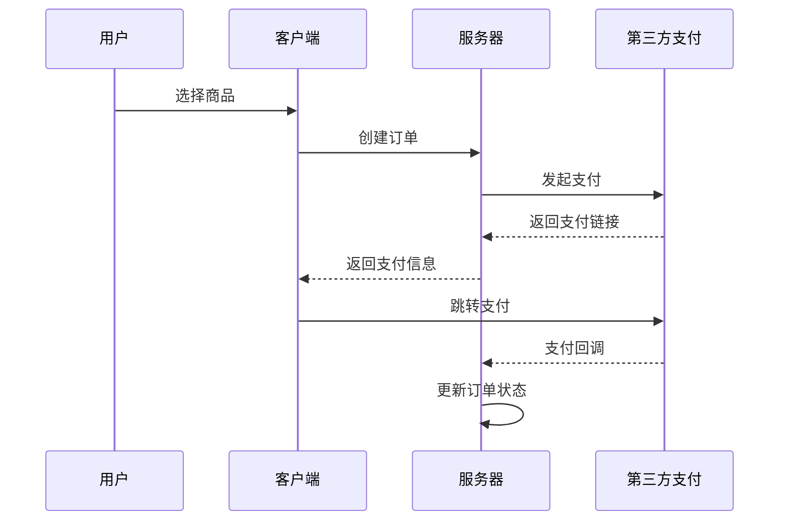

# 第三方支付服务 API

提供支付功能的 API 接口。

## 功能模块

### 1. 钻石充值

| 接口 | 说明 |
|------|------|
| 申请充值 | 创建钻石充值订单 |
| 查询订单 | 查询充值订单状态 |

### 2. 会员购买

| 接口 | 说明 |
|------|------|
| 月度会员 | product_id=1 |
| 季度会员 | product_id=2 |
| 半年会员 | product_id=3 |
| 年度会员 | product_id=4 |

## 支付流程



## 请求参数说明

| 参数 | 类型 | 必填 | 说明 |
|------|------|------|------|
| payment_provider | string | 是 | 支付提供商 (fgpay) |
| channel_code | string | 是 | 支付渠道代码 |
| payer_name | string | 是 | 付款人姓名 |
| return_url | string | 否 | 支付完成返回地址 |
| product_type | string | 是 | 产品类型 (diamond/membership) |
| product_id | integer | 是 | 产品 ID |

## 响应示例

```json
{
  "code": 0,
  "msg": "success",
  "data": {
    "out_order_no": "D20251229120000abc12345",
    "pay_url": "https://pay.example.com/pay?order=xxx",
    "amount": "100"
  }
}
```

<Warning>
支付回调地址仅供第三方支付服务调用，请勿手动访问。
</Warning>
