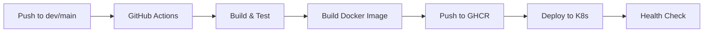

## Overview

The CMS OMS service uses GitHub Actions for CI/CD with automatic deployment to Kubernetes.

## Deployment Flow



## Branches

### Development Branch

- **Branch**: `dev`
- **Environment**: Development
- **URL**: `https://dev-admin.beauty-666.com`
- **Namespace**: `x-dev`
- **Auto-Deploy**: Yes

### Production Branch

- **Branch**: `main`
- **Environment**: Production
- **URL**: `https://admin.beauty-666.com`
- **Namespace**: `x-prod`
- **Auto-Deploy**: Yes (with approval)

## GitHub Actions Workflow

### Build and Deploy Workflow

Located at: `.github/workflows/deploy.yml`

```yaml
name: Build and Deploy

on:
  push:
    branches:
      - dev
      - main

jobs:
  build:
    runs-on: ubuntu-latest
    steps:
      - name: Checkout code
        uses: actions/checkout@v3

      - name: Set up Go
        uses: actions/setup-go@v4
        with:
          go-version: '1.20'

      - name: Run tests
        run: go test ./...

      - name: Build
        run: go build -o cms-oms-server

      - name: Build Docker image
        run: |
          docker build -t ghcr.io/axiom888/cms-site-svc-oms:${{ github.ref_name }}-latest .

      - name: Push to GitHub Container Registry
        run: |
          echo "${{ secrets.GITHUB_TOKEN }}" | docker login ghcr.io -u ${{ github.actor }} --password-stdin
          docker push ghcr.io/axiom888/cms-site-svc-oms:${{ github.ref_name }}-latest

      - name: Deploy to Kubernetes
        uses: azure/k8s-deploy@v4
        with:
          namespace: x-${{ github.ref_name }}
          manifests: |
            k8s/deployment.yaml
            k8s/service.yaml
          images: |
            ghcr.io/axiom888/cms-site-svc-oms:${{ github.ref_name }}-latest
```

## Container Registry

Images are pushed to GitHub Container Registry (GHCR):

- **Registry**: `ghcr.io`
- **Repository**: `axiom888/cms-site-svc-oms`
- **Tags**:
  - `dev-latest` - Latest development build
  - `main-latest` - Latest production build
  - `sha-<commit>` - Specific commit builds

### Pull Image

```bash
# Dev image
docker pull ghcr.io/axiom888/cms-site-svc-oms:dev-latest

# Production image
docker pull ghcr.io/axiom888/cms-site-svc-oms:main-latest
```

## Kubernetes Deployment

### Development Environment

```yaml
apiVersion: apps/v1
kind: Deployment
metadata:
  name: cmsoms
  namespace: x-dev
spec:
  replicas: 1
  selector:
    matchLabels:
      app: cmsoms
  template:
    metadata:
      labels:
        app: cmsoms
    spec:
      containers:
      - name: cmsoms
        image: ghcr.io/axiom888/cms-site-svc-oms:dev-latest
        ports:
        - containerPort: 8080
        env:
        - name: CONFIG_FILE
          value: config.dev.yaml
        resources:
          requests:
            memory: "256Mi"
            cpu: "250m"
          limits:
            memory: "512Mi"
            cpu: "500m"
```

### Check Deployment Status

```bash
# Check pods
kubectl get pods -n x-dev | grep cmsoms

# Check logs
kubectl logs -f <pod-name> -n x-dev

# Describe pod
kubectl describe pod <pod-name> -n x-dev
```

## Manual Deployment

### Build Image Locally

```bash
# Build for development
docker build -t ghcr.io/axiom888/cms-site-svc-oms:dev-latest .

# Push to registry
docker push ghcr.io/axiom888/cms-site-svc-oms:dev-latest
```

### Deploy to Kubernetes

```bash
# Update deployment
kubectl set image deployment/cmsoms \
  cmsoms=ghcr.io/axiom888/cms-site-svc-oms:dev-latest \
  -n x-dev

# Force restart
kubectl rollout restart deployment/cmsoms -n x-dev

# Check rollout status
kubectl rollout status deployment/cmsoms -n x-dev
```

## Environment Variables

Set these secrets in GitHub repository settings:

| Secret | Description |
|--------|-------------|
| GITHUB_TOKEN | Automatically provided by GitHub |
| KUBE_CONFIG | Kubernetes config for deployment |
| DB_PASSWORD | Database password |

## Deployment Checklist

Before deploying to production:

- [ ] All tests passing
- [ ] Code reviewed and approved
- [ ] Database migrations tested
- [ ] Configuration files updated
- [ ] Environment variables set
- [ ] Health check endpoints working
- [ ] Rollback plan prepared

## Rollback

### Automatic Rollback

GitHub Actions will automatically rollback if health checks fail.

### Manual Rollback

```bash
# View rollout history
kubectl rollout history deployment/cmsoms -n x-dev

# Rollback to previous version
kubectl rollout undo deployment/cmsoms -n x-dev

# Rollback to specific revision
kubectl rollout undo deployment/cmsoms --to-revision=2 -n x-dev
```

## Monitoring

### Health Checks

The service exposes health check endpoints:

```bash
# Liveness probe
curl http://cmsoms-service:8080/health

# Readiness probe
curl http://cmsoms-service:8080/ready
```

### Logs

View logs in real-time:

```bash
# Tail logs
kubectl logs -f deployment/cmsoms -n x-dev

# Logs from all pods
kubectl logs -l app=cmsoms -n x-dev --all-containers=true
```

## Deployment History

### Recent Deployments

| Date | Commit | Version | Notes |
|------|--------|---------|-------|
| 2026-01-06 | 81879c2 | v1.1 | Fixed diamond config routes |
| 2026-01-06 | 697bce7 | v1.1 | Added diamond config routes |
| 2026-01-05 | c89cc6e | v1.0 | Initial homepage module |

## Troubleshooting

### Image Pull Errors

```bash
# Check image exists
docker pull ghcr.io/axiom888/cms-site-svc-oms:dev-latest

# Verify registry credentials
kubectl get secrets -n x-dev
```

### Pod Crash Loop

```bash
# Check logs
kubectl logs <pod-name> -n x-dev --previous

# Check events
kubectl get events -n x-dev --sort-by='.lastTimestamp'
```

### Service Not Accessible

```bash
# Check service
kubectl get svc -n x-dev

# Check ingress
kubectl get ingress -n x-dev

# Test from within cluster
kubectl run -it --rm debug --image=curlimages/curl --restart=Never -n x-dev -- \
  curl http://cmsoms-service:8080/health
```
